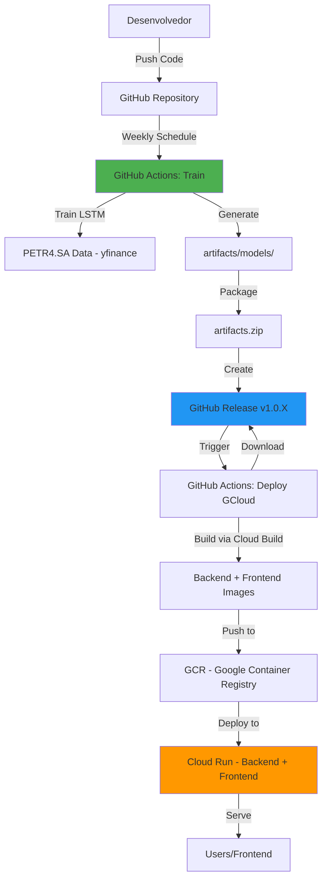

# 🤖 Arquitetura MLOps - PETR4.SA Stock Prediction

**Status:** ✅ Implementado  
**Data:** 11 de janeiro de 2026  
**Ticker:** PETR4.SA (Petrobras)  
**Custo:** $0-7/mês

---

## 📊 Visão Geral da Solução

Este documento descreve a arquitetura MLOps completa implementada para o projeto de previsão de ações, com foco em **baixo custo** e **alta automação**.

Para um resumo executivo focado no deploy em Google Cloud (Cloud Run + Cloud Build) e nos artefatos já implementados, veja também [IMPLEMENTATION_SUMMARY.md](../IMPLEMENTATION_SUMMARY.md).

### 🎯 Objetivos Alcançados

- ✅ Treino automatizado semanal (GitHub Actions)
- ✅ Versionamento de modelos via GitHub Releases
- ✅ Deploy automático após treino bem-sucedido
- ✅ API containerizada (Docker + PyTorch CPU)
- ✅ Custo zero ou mínimo (Free Tier)
- ✅ Fácil rollback (GitHub Releases)
- ✅ CI/CD nativo (GitHub Actions)

---

## 🏗️ Arquitetura Detalhada



---

## 📂 Estrutura de Arquivos

### **Novos Arquivos Criados:**

```
.github/workflows/
├── train-weekly.yml         # Treino semanal automatizado
└── deploy-gcloud.yml        # Deploy GCloud Run (Backend + Frontend)

scripts/
├── local_train.sh           # Treino local para dev
├── validate_artifacts.sh    # Validação de artifacts
├── test_api_local.sh        # Teste API local
└── setup_gcloud.sh          # Setup automático GCP

docs/
├── GCLOUD_DEPLOY.md         # Guia completo Google Cloud
└── alternatives/
    └── DEPLOY_FREE_TIER.md  # Alternativas (Render/Railway)

cloudbuild.yaml              # Config Google Cloud Build
artifacts/.gitkeep           # Placeholder (artifacts não versionados)
```

### **Arquivos Modificados:**

```
Dockerfile                   # Suporte download de artifacts do GitHub Release
.gitignore                   # Excluir artifacts/ do Git
```

---

## 🔄 Fluxo de Trabalho Completo

### **1️⃣ Desenvolvimento Local**

```bash
# 1. Treinar modelo localmente
./scripts/local_train.sh

# 2. Validar artifacts
./scripts/validate_artifacts.sh

# 3. Testar API local
./scripts/test_api_local.sh

# 4. Commit e push (sem artifacts)
git add .
git commit -m "feat: update model code"
git push origin master
```

**Artifacts gerados:**
- `artifacts/models/best_model.pt` (~8MB)
- `artifacts/models/scalers/scaler.pkl` (~5KB)
- `artifacts/models/scalers/preprocessing_config.json` (~1KB)
- `artifacts/metrics.json` (~1KB)

---

### **2️⃣ Treino Automatizado (GitHub Actions)**

**Trigger:** Cron semanal (Domingo 00:00 UTC) ou manual

**Workflow:** `.github/workflows/train-weekly.yml`

**Steps:**
1. Setup Python 3.11
2. Install PyTorch CPU (optimized)
3. Install dependencies
4. Train LSTM (PETR4.SA, 100 epochs)
5. Validate artifacts (`artifacts/models/best_model.pt` + scalers)
6. Package artifacts.zip
7. Create GitHub Release (v1.0.X)
8. Upload artifacts.zip to Release

**Tempo de execução:** ~5-10 minutos  
**Custo:** $0 (GitHub Actions Free Tier: 2000 min/mês)

---

### **3️⃣ Deploy Automatizado (GitHub Actions)**

**Trigger:** Após treino bem-sucedido ou push na master

**Workflow:** `.github/workflows/deploy-gcloud.yml`

**Steps:**
1. Download artifacts from latest Release
2. Build Backend via Cloud Build
3. Deploy Backend to Cloud Run
4. Build Frontend via Cloud Build
5. Deploy Frontend to Cloud Run
6. Health check (Backend + Frontend)

**Tempo de execução:** ~15-20 minutos  
**Custo:** $0 (Free Tier) até $4-8/mês (produção)

---

### **4️⃣ Produção (Google Cloud Run)**

**Plataforma Principal:** Google Cloud Run

| Componente | Configuração | Cold Start | Custo |
|------------|--------------|------------|-------|
| **Backend API** | 512MB RAM, 1 vCPU | ⚠️ Configurável (min-instances=0) | $3-5/mês |
| **Frontend** | 256MB RAM, 1 vCPU | ⚠️ Configurável (min-instances=0) | $1-2/mês |
| **Cloud Build** | 4 builds/mês | N/A | $0 (Free Tier) |
| **Container Registry** | ~1GB storage | N/A | $0.02/mês |

**Plataformas Alternativas (ver [docs/alternatives/DEPLOY_FREE_TIER.md](alternatives/DEPLOY_FREE_TIER.md)):**

| Plataforma | Custo | RAM | CPU | Cold Start |
|------------|-------|-----|-----|------------|
| **Render Free** | $0/mês | 512MB | 0.1 shared | ❌ Sim (~30s) |
| **Render Starter** | $7/mês | 512MB | 0.5 dedicated | ✅ Não |
| **Railway Hobby** | $5/mês | 8GB | 8 shared | ✅ Não |

**Recomendação:** 
- **Produção (Oficial):** Google Cloud Run ($4-8/mês)
- **Protótipo/Teste:** Render Free ($0)
- **Alternativa Low-Cost:** Railway Hobby ($5/mês)

---

## 🐳 Dockerfile - Download de Artifacts

### **Estratégia Híbrida:**

1. **Desenvolvimento Local:** Usa `artifacts/` local (se existir)
2. **Produção (CI/CD):** Baixa do GitHub Release (via API)

### **Build Arguments:**

```bash
# Dev (usar artifacts local)
docker build -t stock-api:dev --build-arg DOWNLOAD_ARTIFACTS=false .

# Production (baixar do GitHub)
docker build -t stock-api:prod --build-arg DOWNLOAD_ARTIFACTS=true .
```

### **Lógica do Dockerfile:**

```dockerfile
ARG DOWNLOAD_ARTIFACTS="true"
ARG GITHUB_REPO="adriannylelis/stock-prediction-lstm-api"

RUN if [ "$DOWNLOAD_ARTIFACTS" = "true" ] && [ ! -f "artifacts/models/best_model.pt" ]; then \
        # Buscar última release via GitHub API
        LATEST_RELEASE=$(curl -s https://api.github.com/repos/$GITHUB_REPO/releases/latest); \
        DOWNLOAD_URL=$(echo $LATEST_RELEASE | jq -r '.assets[0].browser_download_url'); \
        # Download e unzip para artifacts/models/
        curl -L -o artifacts.zip "$DOWNLOAD_URL" && \
        mkdir -p artifacts/models && \
        unzip artifacts.zip -d artifacts/models/; \
    else \
        echo "Using local artifacts (dev mode)"; \
    fi
```

---

## 📦 GitHub Releases - Versionamento de Modelos

### **Nomenclatura:**

```
v1.0.1 - Model Release (10/01/2026)
v1.0.2 - Model Release (17/01/2026)
v1.0.3 - Model Release (24/01/2026)
```

### **Conteúdo de cada Release:**

```
artifacts.zip (10-20MB)
├── best_model.pt                          # Modelo LSTM treinado
├── scalers/
│   ├── scaler.pkl                         # MinMaxScaler de features (18 features)
│   └── preprocessing_config.json          # Config de pré-processamento
└── metrics.json                           # Métricas de treino (opcional)
```

### **Metadados:**

Cada Release contém descrição detalhada:
- Ticker (PETR4.SA)
- Data de treino
- Hyperparameters
- Métricas de performance
- Instruções de uso

---

## 🔐 GitHub Secrets (Configurar)

### **Obrigatórios (para Google Cloud Run):**

```bash
# Google Cloud Platform
GCP_PROJECT_ID=your-project-id           # ID do projeto GCP
GCP_SA_KEY=<service-account-key-json>   # Chave JSON da Service Account
```

### **Opcionais (para deploy em plataformas alternativas):**

```bash
# Render.com (alternativa)
RENDER_DEPLOY_HOOK=https://api.render.com/deploy/srv-xxxxx?key=yyyyy
RENDER_URL=https://stock-api-petr4.onrender.com

# Railway.app (não precisa secrets, deploy é automático via GitHub)
```

**Como adicionar:**
1. GitHub → Settings → Secrets and variables → Actions
2. New repository secret
3. Adicionar Name e Value

---

## 🧪 Testes e Validação

### **1. Teste Local Completo**

```bash
# Treino
./scripts/local_train.sh

# Validação
./scripts/validate_artifacts.sh

# API
./scripts/test_api_local.sh
```

### **2. Teste GitHub Actions (Manual)**

1. **Actions** → **🤖 Train Model Weekly** → **Run workflow**
2. Aguardar ~10 minutos
3. Verificar Release criada
4. **Actions** → **🌐 Deploy to Google Cloud** → **Run workflow**
5. Aguardar ~15-20 minutos
6. Obter URLs do Job Summary e testar:
   ```bash
   # Backend
   curl https://stock-api-backend-xxx-uc.a.run.app/health
   
   # Frontend
   open https://stock-api-frontend-xxx-uc.a.run.app
   ```

### **3. Teste de Rollback**

```bash
# Caso nova versão tenha problema, re-deploy versão anterior:

# 1. Na plataforma (Render/Railway), trigger manual deploy
# 2. Ou criar nova Release apontando para artifacts antigos
# 3. GitHub Actions re-deploy automaticamente
```

---

## 📊 Monitoramento e Observabilidade

### **Ferramentas Recomendadas (Free Tier):**

1. **Uptime Monitoring:**
   - [UptimeRobot](https://uptimerobot.com) (grátis, 50 monitors)
   - Ping `/health` a cada 5 minutos
   - Alerta via email/Slack

2. **Error Tracking:**
   - [Sentry](https://sentry.io) (grátis, 5k events/mês)
   - Captura exceções da API
   - Stack traces detalhados

3. **Logs:**
   - Render/Railway built-in logs (grátis)
   - Ou [Logfire](https://logfire.com) (grátis)

4. **Métricas:**
   - GitHub Actions built-in metrics
   - Render/Railway dashboards

---

## 💰 Estimativa de Custos (Mensal)

### **Opção 1: 100% Grátis**

```
GitHub Actions: $0 (2000 min grátis)
GitHub Releases: $0 (storage ilimitado)
Render Free Tier: $0
UptimeRobot: $0
Sentry: $0
────────────────────
TOTAL: $0/mês 🎉
```

### **Opção 2: Produção Leve**

```
GitHub Actions: $0
GitHub Releases: $0
Railway Hobby: $5/mês
Domain (Namecheap): $1/mês
────────────────────
TOTAL: $6/mês
```

### **Opção 3: Produção Profissional**

```
GitHub Actions: $0
Render Starter: $7/mês
Domain + SSL: $1/mês
Sentry Pro: $0 (free tier suficiente)
────────────────────
TOTAL: $8/mês
```

---

## 🚀 Próximos Passos (Roadmap)

### **Curto Prazo (1-2 semanas):**
- [ ] Configurar UptimeRobot
- [ ] Adicionar Sentry
- [ ] Testar treino semanal automatizado
- [ ] Documentar métricas de performance

### **Médio Prazo (1 mês):**
- [ ] Adicionar cache Redis (Upstash Free Tier)
- [ ] Implementar batch predictions
- [ ] Dashboard de monitoramento (Streamlit ou Grafana)
- [ ] Suporte multi-ticker (via query param)

### **Longo Prazo (3 meses):**
- [ ] A/B testing de modelos
- [ ] Feature store (Feast)
- [ ] Data drift detection
- [ ] Model explainability (SHAP)

---

## 📚 Referências e Documentação

- [GitHub Actions Docs](https://docs.github.com/en/actions)
- [Google Cloud Run Docs](https://cloud.google.com/run/docs)
- [Google Cloud Build Docs](https://cloud.google.com/build/docs)
- [Dockerfile Best Practices](https://docs.docker.com/develop/dev-best-practices/)
- [PyTorch Production](https://pytorch.org/tutorials/beginner/saving_loading_models.html)
- [GCLOUD_DEPLOY.md](GCLOUD_DEPLOY.md) - Guia completo de deploy na GCP
- [alternatives/DEPLOY_FREE_TIER.md](alternatives/DEPLOY_FREE_TIER.md) - Alternativas Render/Railway

---

## 🎯 Conclusão

### **Benefícios da Arquitetura Implementada:**

✅ **Custo Zero/Mínimo:** $0-7/mês  
✅ **Totalmente Automatizado:** Zero intervenção manual  
✅ **Versionamento Robusto:** GitHub Releases = Model Registry  
✅ **Fácil Rollback:** Re-deploy release anterior  
✅ **Escalável:** Migração fácil para GCP/AWS se necessário  
✅ **Reprodutível:** Tudo como código (IaC)  
✅ **Seguro:** Sem credentials no código  
✅ **Testável:** Scripts de teste local  

### **Trade-offs Aceitos:**

⚠️ **Cold start no Free Tier:** 30s (mitigado com ping ou upgrade)  
⚠️ **Sem MLflow UI:** Compensado por GitHub Releases  
⚠️ **Single Ticker:** Simplifica operação (expansível no futuro)  

---

**Arquitetura aprovada e pronta para produção!** 🚀
