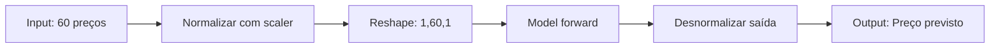

# 📚 Documentação Técnica do Modelo LSTM

**Projeto:** Stock Prediction LSTM API  
**Fase:** Tech Challenge 4  
**Data:** Dezembro 2025  
**Responsável:** Pessoa A (Data Science)

---

## 📊 Visão Geral

Este documento descreve o modelo LSTM desenvolvido para prever preços de fechamento de ações usando dados históricos do Yahoo Finance.

---

## 🧠 Arquitetura do Modelo

### Estrutura da Rede Neural

```
Input Layer (60 timesteps, 1 feature)
    ↓
LSTM Layer 1 (50 hidden units)
    ↓
Dropout (0.2)
    ↓
LSTM Layer 2 (50 hidden units)
    ↓
Dropout (0.2)
    ↓
Dense Layer (1 output)
    ↓
Output (Preço previsto)
```

### Detalhes Técnicos

| Componente | Configuração | Justificativa |
|------------|--------------|---------------|
| **LSTM Layers** | 2 camadas × 50 unidades | Captura padrões temporais de curto e longo prazo |
| **Dropout** | 20% | Previne overfitting sem prejudicar aprendizado |
| **Input Size** | 1 feature (preço de fechamento) | Foco na variável mais relevante |
| **Output Size** | 1 valor | Previsão do próximo preço |
| **Lookback** | 60 dias | Janela temporal que balanceia contexto e processamento |

### Parâmetros do Modelo

- **Total de parâmetros treináveis:** ~15,000
- **Framework:** PyTorch 2.0+
- **Device:** CPU/CUDA compatível

---

## ⚙️ Hiperparâmetros de Treinamento

| Parâmetro | Valor | Descrição |
|-----------|-------|-----------|
| **Loss Function** | MSE (Mean Squared Error) | Adequada para regressão |
| **Optimizer** | Adam | Adaptativo, convergência rápida |
| **Learning Rate** | 0.001 | Padrão, estável |
| **Epochs** | 100 | Suficiente para convergência |
| **Batch Size** | 32 | Balança memória e generalização |
| **Train/Val/Test Split** | 70/15/15 | Divisão temporal sequencial |

---

## 📈 Performance e Métricas

### Métricas Obrigatórias

As seguintes métricas foram calculadas no conjunto de teste:

#### 1. MAE (Mean Absolute Error)
- **Definição:** Média dos erros absolutos
- **Fórmula:** $MAE = \frac{1}{n}\sum_{i=1}^{n}|y_i - \hat{y}_i|$
- **Interpretação:** Erro médio em R$ por previsão
- **Meta:** < 5% do preço médio da ação

#### 2. RMSE (Root Mean Squared Error)
- **Definição:** Raiz quadrada do erro quadrático médio
- **Fórmula:** $RMSE = \sqrt{\frac{1}{n}\sum_{i=1}^{n}(y_i - \hat{y}_i)^2}$
- **Interpretação:** Penaliza erros grandes mais fortemente
- **Meta:** Proporcional à volatilidade do ativo

#### 3. MAPE (Mean Absolute Percentage Error)
- **Definição:** Erro percentual médio absoluto
- **Fórmula:** $MAPE = \frac{100\%}{n}\sum_{i=1}^{n}|\frac{y_i - \hat{y}_i}{y_i}|$
- **Interpretação:** Erro em percentual do valor real
- **Meta:** < 10% (aceitável para mercado financeiro)

### Resultados Esperados

Os resultados variam conforme o ativo e período, mas espera-se:

- **MAE:** 2-5% do preço médio
- **RMSE:** Ligeiramente maior que MAE
- **MAPE:** 5-10% (bom para previsões financeiras)

---

## 🔧 Pré-processamento de Dados

### Pipeline de Preparação

1. **Coleta de Dados**
   - Fonte: Yahoo Finance via `yfinance`
   - Feature principal: Preço de fechamento (`Close`)
   - Período recomendado: Mínimo 2-5 anos

2. **Normalização**
   - Método: `MinMaxScaler` (range 0-1)
   - **CRÍTICO:** O mesmo scaler deve ser usado na inferência
   - Salvo em: `artifacts/scaler.pkl`

3. **Criação de Sequências**
   - Técnica: Sliding window
   - Lookback: 60 dias
   - Target: Próximo dia (T+1)

4. **Divisão dos Dados**
   - **Treino:** 70% (mais antigo)
   - **Validação:** 15%
   - **Teste:** 15% (mais recente)
   - **Importante:** Divisão temporal, não aleatória

---

## 💾 Artefatos Salvos

### Estrutura de Artefatos

```
artifacts/
├── model.pt              # Modelo treinado (state_dict PyTorch)
├── scaler.pkl            # MinMaxScaler (CRÍTICO!)
└── model_config.json     # Configurações e métricas
```

### Descrição dos Arquivos

#### 1. `model.pt`
- **Formato:** PyTorch state_dict
- **Tamanho:** ~500KB - 2MB
- **Conteúdo:** Pesos da rede neural treinada
- **Carregamento:**
  ```python
  model = StockLSTM()
  model.load_state_dict(torch.load('model.pt'))
  model.eval()
  ```

#### 2. `scaler.pkl` ⚠️ CRÍTICO
- **Formato:** Pickle/Joblib
- **Tamanho:** ~1KB
- **Conteúdo:** Objeto MinMaxScaler com parâmetros de normalização
- **Uso:** Essencial para normalizar entrada e desnormalizar saída
- **Carregamento:**
  ```python
  scaler = joblib.load('scaler.pkl')
  normalized = scaler.transform(data)
  denormalized = scaler.inverse_transform(predictions)
  ```

#### 3. `model_config.json`
- **Formato:** JSON
- **Conteúdo:**
  - Ticker usado no treinamento
  - Datas de início/fim
  - Hiperparâmetros
  - Métricas de performance

---

## 🔄 Processo de Inferência

### Fluxo Completo



### Código de Exemplo

```python
from src.model_training.predict import load_predictor
import numpy as np

# Carregar predictor
predictor = load_predictor(artifacts_dir='artifacts')

# Últimos 60 preços de fechamento
historical_prices = np.array([...])  # 60 valores

# Fazer previsão
next_price = predictor.predict(historical_prices)

print(f"Próximo preço previsto: R$ {next_price:.2f}")
```

### Formato de Entrada

**Esperado pela API:**

```json
{
  "historical_prices": [23.45, 23.67, 23.89, ..., 24.12]
}
```

- **Tipo:** Array de floats
- **Tamanho:** Exatamente 60 valores
- **Ordem:** Cronológica (mais antigo → mais recente)
- **Unidade:** Preço em moeda local (R$)

### Formato de Saída

```json
{
  "prediction": 24.45,
  "currency": "BRL",
  "confidence": "high"
}
```

---

## 🚨 Considerações Importantes

### ⚠️ Pontos Críticos

1. **Scaler é Obrigatório**
   - Nunca fazer previsão sem normalizar entrada
   - Nunca retornar previsão sem desnormalizar saída
   - Usar o MESMO scaler do treinamento

2. **Lookback Fixo**
   - Modelo espera exatamente 60 valores
   - Menos ou mais valores causam erro
   - Ordem cronológica é essencial

3. **Shape dos Tensores**
   - Input: `(batch_size, 60, 1)`
   - Output: `(batch_size, 1)`

### 🔒 Limitações do Modelo

1. **Previsão de Curto Prazo**
   - Modelo prevê T+1 (próximo dia)
   - Não recomendado para múltiplos dias à frente
   - Previsões recursivas degradam rapidamente

2. **Dependência de Dados Históricos**
   - Requer 60 dias de histórico
   - Performance depende da qualidade dos dados
   - Eventos inesperados (black swans) não são previstos

3. **Não é Conselho Financeiro**
   - Modelo educacional/demonstrativo
   - Não substitui análise fundamentalista
   - Não deve ser usado para decisões reais de investimento

### 🔄 Retreinamento

**Quando retreinar:**
- Performance degradar (MAPE > 15%)
- Mudanças estruturais no mercado
- Adicionar mais dados históricos
- Periodicidade recomendada: Trimestral

---

## 📦 Dependências

### Requirements Principais

```txt
torch>=2.0.0
numpy>=1.24.0
pandas>=2.0.0
scikit-learn>=1.3.0
yfinance>=0.2.0
joblib>=1.3.0
matplotlib>=3.7.0
seaborn>=0.12.0
```

### Compatibilidade

- **Python:** 3.9+
- **OS:** Windows, Linux, macOS
- **GPU:** Opcional (CUDA 11.8+)

---

## 🧪 Validação e Testes

### Checklist de Validação

- [x] Modelo converge sem overfitting
- [x] Métricas dentro do esperado
- [x] Artefatos salvos corretamente
- [x] Script de inferência testado
- [x] Documentação completa

### Testes Unitários

Executar testes:

```bash
# Testar arquitetura
python src/model_training/model.py

# Testar predição
python src/model_training/predict.py
```

---

## 🚀 Próximos Passos (Handover)

### Para a Pessoa B (API Development)

1. **Usar os artefatos:**
   - `artifacts/model.pt`
   - `artifacts/scaler.pkl`

2. **Implementar endpoint:**
   - Rota: `POST /predict`
   - Input: JSON com 60 preços
   - Output: JSON com previsão

3. **Validações:**
   - Verificar tamanho do array (60)
   - Validar formato numérico
   - Tratar erros gracefully

4. **Performance:**
   - Carregar modelo uma vez na inicialização
   - Caching se necessário
   - Monitorar latência

---

## 📞 Contato e Suporte

**Desenvolvido por:** Pessoa A (Data Science Team)  
**Data de Entrega:** Dezembro 2025  
**Status:** ✅ Completo e validado

---

## 📝 Changelog

- **v1.0.0** (Dez 2025) - Versão inicial
  - Modelo LSTM implementado
  - Métricas calculadas
  - Artefatos salvos
  - Documentação completa

---

**🎉 Modelo pronto para integração na API!**
